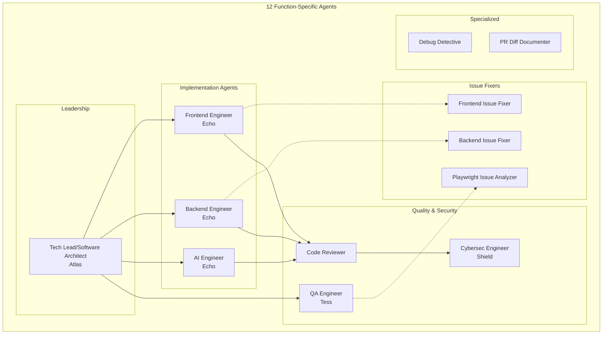
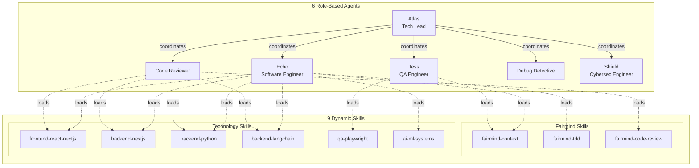
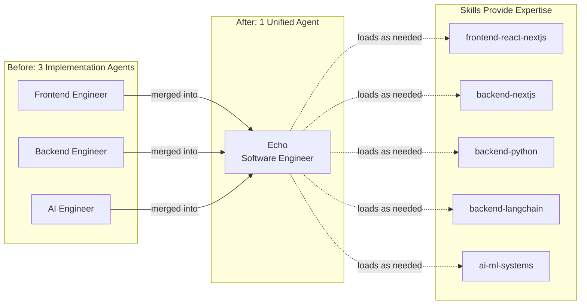
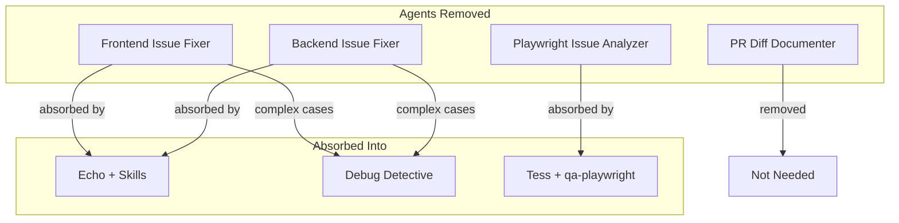
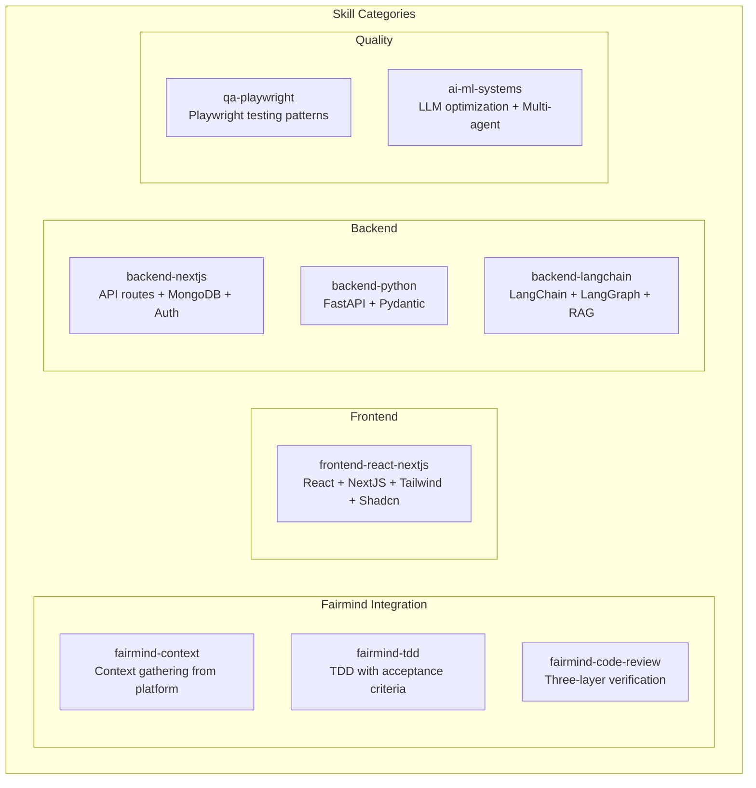
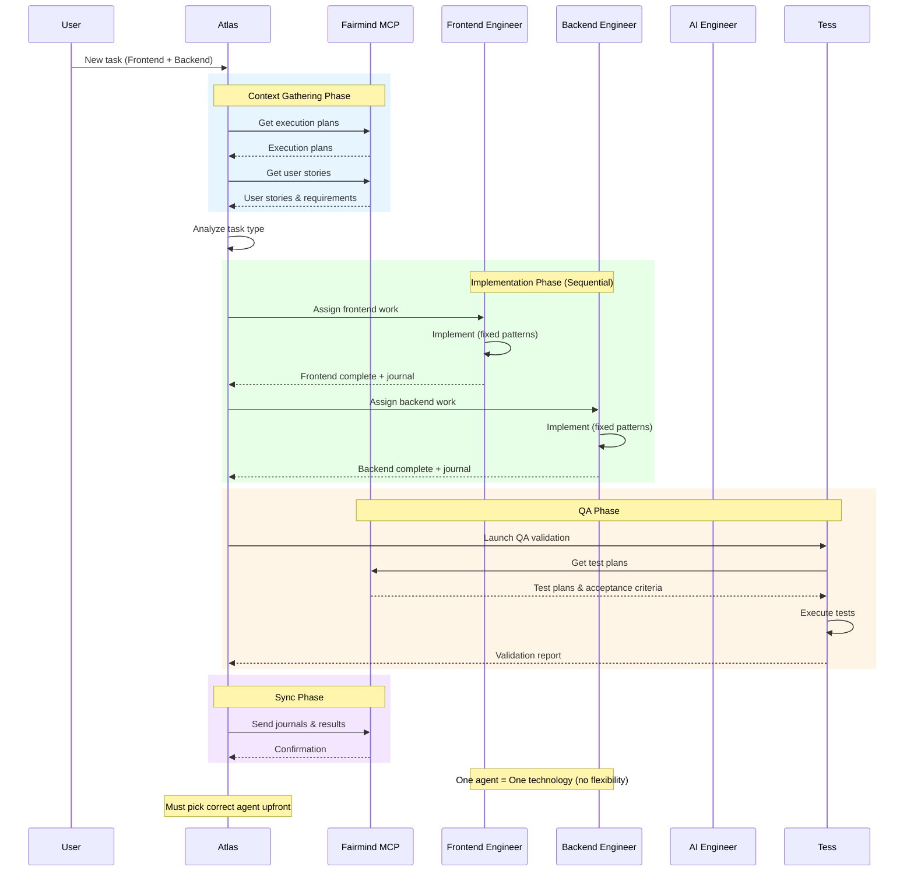
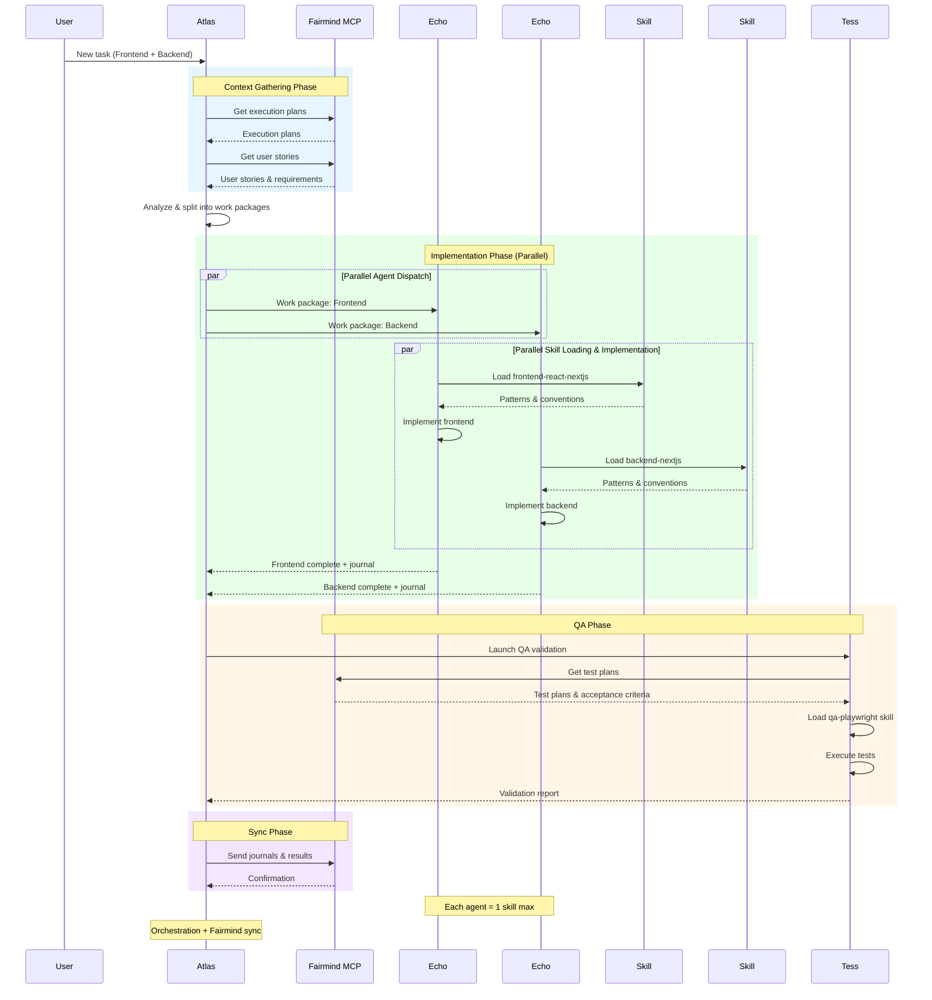
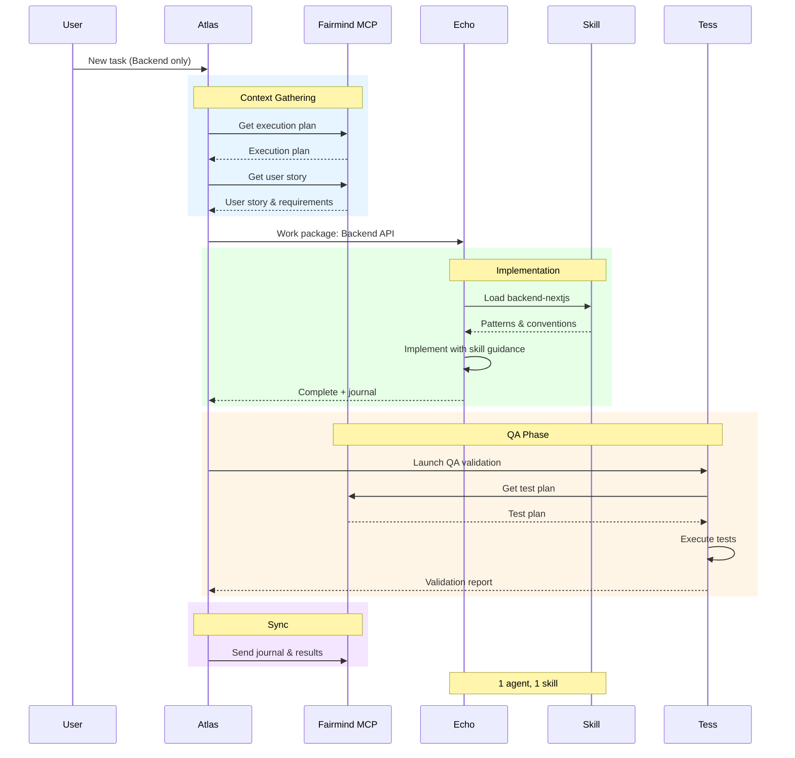
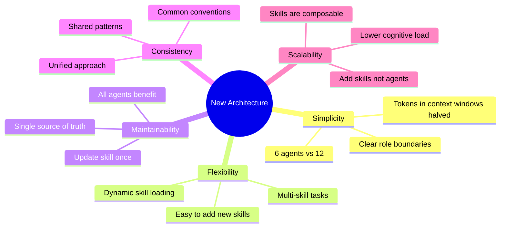

# Agent Architecture Evolution

This document describes the transformation from 12 function-specific agents to 6 role-based agents with skills.

## Executive Summary

| Aspect | Before (main) | After (refactor) |
|--------|---------------|------------------|
| Agents | 12 | 6 |
| Skills | 0 | 9 |
| Approach | Function-specific | Role-based + Dynamic Skills |
| Flexibility | Low (fixed expertise) | High (skill loading) |

---

## Before: Function-Specific Agents (main branch)

The original architecture had **12 specialized agents**, each with fixed expertise and responsibilities.



### Agent List (main branch)

| # | Agent | File | Role |
|---|-------|------|------|
| 1 | Atlas (Tech Lead) | `tech-lead-software-architect.md` | Orchestration, work package creation |
| 2 | Echo (Frontend Engineer) | `frontend-engineer.md` | React, NextJS, Tailwind, Shadcn UI |
| 3 | Echo (Backend Engineer) | `backend-engineer.md` | NextJS API, MongoDB, Zustand |
| 4 | Echo (AI Engineer) | `ai-engineer.md` | LangChain, LangGraph, Prompt Engineering |
| 5 | Frontend Issue Fixer | `frontend-issue-fixer.md` | Frontend bug resolution |
| 6 | Backend Issue Fixer | `backend-issue-fixer.md` | Backend bug resolution |
| 7 | Playwright Issue Analyzer | `playwright-issue-analyzer.md` | Test failure analysis |
| 8 | Tess (QA Engineer) | `qa-engineer.md` | Test planning and execution |
| 9 | Code Reviewer | `code-reviewer.md` | Code quality verification |
| 10 | Shield (Cybersec Engineer) | `cybersec-engineer.md` | Security validation |
| 11 | Debug Detective | `debug-detective.md` | Complex debugging scenarios |
| 12 | PR Diff Documenter | `pr-diff-documenter.md` | PR documentation generation |

### Problems with This Approach

1. **Agent Proliferation**: Too many specialized agents to maintain
2. **Fixed Expertise**: Each agent could only do one thing
3. **No Knowledge Sharing**: Patterns duplicated across agents
4. **Rigid Assignment**: Tech lead had to pick exact agent for each task
5. **Maintenance Burden**: Updates needed in multiple agent files

---

## After: Role-Based Agents with Skills (current branch)

The new architecture uses **6 role-based agents** that dynamically load **9 skills** based on task requirements.



### Agent Consolidation



### Removed Agents



---

## Skills Architecture



### Skill Loading Matrix

| Agent | Skills They Can Load |
|-------|---------------------|
| **Echo (Software Engineer)** | `frontend-react-nextjs`, `backend-nextjs`, `backend-python`, `backend-langchain`, `ai-ml-systems`, `fairmind-context`, `fairmind-tdd` |
| **Tess (QA Engineer)** | `qa-playwright`, `fairmind-context` |
| **Code Reviewer** | `fairmind-code-review`, `frontend-react-nextjs`, `backend-nextjs`, `backend-python`, `backend-langchain` |
| **Debug Detective** | All skills as needed for context |
| **Shield (Cybersec)** | Technology skills for security context |
| **Atlas (Tech Lead)** | None (orchestration only) |

---

## Workflow Comparison

### Before: Fixed Agent Assignment



### After: Dynamic Skill Loading (Parallel Agents)



#### Single Technology Task



---

## Key Benefits of New Architecture



---

## File Structure Comparison

### Before (main branch)
```
agents/
├── ai-engineer.md              # Fixed AI expertise
├── backend-engineer.md         # Fixed backend expertise
├── backend-issue-fixer.md      # Bug-specific agent
├── code-reviewer.md
├── cybersec-engineer.md
├── debug-detective.md
├── frontend-engineer.md        # Fixed frontend expertise
├── frontend-issue-fixer.md     # Bug-specific agent
├── playwright-issue-analyzer.md
├── pr-diff-documenter.md       # PR-specific agent
├── qa-engineer.md
└── tech-lead-software-architect.md
```

### After (current branch)
```
agents/
├── code-reviewer.md            # Role: Quality verification
├── cybersec-engineer.md        # Role: Security validation
├── debug-detective.md          # Role: Complex debugging
├── qa-engineer.md              # Role: Test execution
├── software-engineer.md        # Role: ALL implementation
└── tech-lead.md                # Role: Orchestration

# Skills (separate directories)
frontend-react-nextjs/          # Skill: Frontend patterns
backend-nextjs/                 # Skill: NextJS backend patterns
backend-python/                 # Skill: Python patterns
backend-langchain/              # Skill: LangChain patterns
qa-playwright/                  # Skill: Playwright patterns
ai-ml-systems/                  # Skill: AI system design
fairmind-context/               # Skill: Context gathering
fairmind-tdd/                   # Skill: TDD workflow
fairmind-code-review/           # Skill: Code review process
```

---

## Summary

| Metric | Before | After | Change |
|--------|--------|-------|--------|
| Total Agents | 12 | 6 | -50% |
| Implementation Agents | 3 | 1 | -67% |
| Issue Fixer Agents | 3 | 0 | -100% |
| Skills | 0 | 9 | +9 |
| Flexibility | Low | High | Improved |
| Maintainability | Low | High | Improved |

The transformation moves from **rigid specialization** to **dynamic capability loading**, making the system more maintainable, flexible, and easier to extend.
